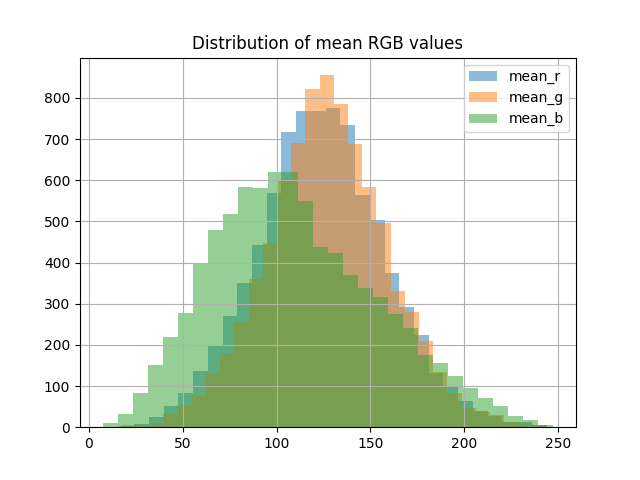
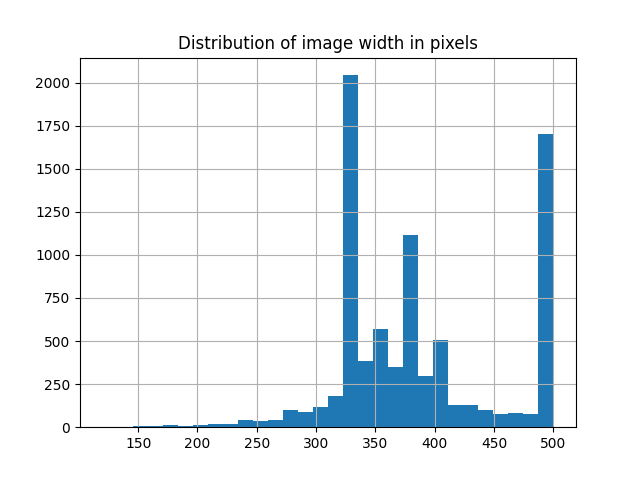
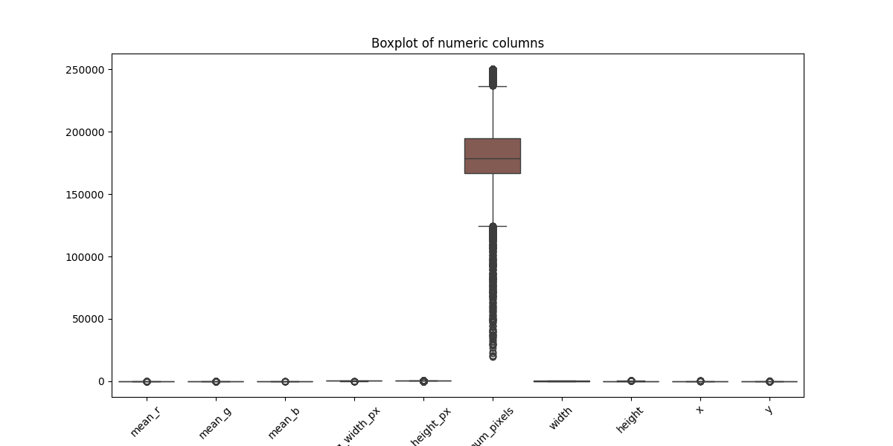

# Rapport EDA of CUB_200_2011 dataset for Bird Classifier

## Context

The aim was to get a better understanding of the data and its quality to prepare for further training with classifying models like AutoML. 
The dataset used was Caltech-UCSD Birds-200-2011 and attached metadata.

## Dataset information

- Sample size: 8251 records (taken from a randomly derived test sample)
- Number of classes (bird species): 200
- Data structure: 
  - Photo identifier (image_id, image_path)
  - Class/bird species (class_id, classes_name)
  - Position and size of a bird on a photo (x, y, width, height)
  - Photo properties (mean rgb channel values mean_r, mean_g, mean_b, resolution img_width_px. img_height_px and num_pixels - number of pixels)

## Quality and data integrity
  - Empty data
    Logs and statistics (```df.insa().sum()```) indicate no empty values in key columns. Data related to classes and their metadata are complete
    ```plain text
        2024-12-07 21:42:56,359 - EDA_Logger - INFO - Checking for missing values in the dataset.
        image_id         0
        image_path       0
        class_id         0
        x                0
        y                0
        width            0
        height           0
        classes_name     0
        mean_r           0
        mean_g           0
        mean_b           0
        img_width_px     0
        img_height_px    0
        num_pixels       0
        dtype: int64  
    ``` 
    - Datatypes
      There is a lot of numerical values (ie. mean_r, mean_g, mean_b, width, height, img_width_px, img_height_px, num_pixels) and categorical variables is mainly classes_name
      Datatypes are as expected (float64 for metadata, int64 for identifiers and object for paths and class names)
      ```Plain Text
      2024-12-07 21:42:56,343 - EDA_Logger - INFO - Displaying datastructure of the dataset.
      <class 'pandas.core.frame.DataFrame'>
      RangeIndex: 8251 entries, 0 to 8250
      Data columns (total 14 columns):
      #   Column         Non-Null Count  Dtype  
      ---  ------         --------------  -----  
      0   image_id       8251 non-null   int64  
      1   image_path     8251 non-null   object 
      2   class_id       8251 non-null   int64  
      3   x              8251 non-null   float64
      4   y              8251 non-null   float64
      5   width          8251 non-null   float64
      6   height         8251 non-null   float64
      7   classes_name   8251 non-null   object 
      8   mean_r         8251 non-null   float64
      9   mean_g         8251 non-null   float64
      10  mean_b         8251 non-null   float64
      11  img_width_px   8251 non-null   float64
      12  img_height_px  8251 non-null   float64
      13  num_pixels     8251 non-null   float64
      dtypes: float64(10), int64(2), object(2)
      memory usage: 902.6+ KB
      ```
      
  ## Analysis of distributions and statistics

  - Basic statistics (describe)
    Means, medians and standard deviations indicate that data is homogeneous
    
    - mean_r, mean_g, mean_b have mean values of around 100-140 which indicates that pictures are not overexposed and underexposed. Historgram of these variables shows almost a normal distribution with small deviation
    
    - Sizes oscillate in the range of 300-500 px, which means. that the data are not extremely varied. There is a visible concentration of photos with width 333-375 px and height 500 px
    
    - num_pixels variable is very varied starting from 20 thousand pixels to 250 thousand pixels which is a direct consequence of image size. Boxplot shows that this particular numerical variable is very varied from the rest which suggest that it is worth to standardize this variable. 
    
  - Class distribution (classes_name)
    It seems fairly equal. The range of photos for each class ranges from 30 to 50 images. There is no need to use any balancing between classes.
  ## Outliers

  - The boxplot above shows that a variable that should catch the most attention is num_pixels. It is nonetheless normal and should not pose any issues. In ML models it could require some normalization to avoid domination of a particular variable. 
  - Other variables did not show any domination that should be eliminated. Outliers can present in bounding boxes provided with the dataset (for example very big or very small depending on the photo of the bird). This is again very normal but can be important for the model. Some birds are very small on the photo and others take up much more space of the frame. 

  ## Correlation between variables
  
  - Colour channels (mean_r, mean_g, mean_b):
    We can observe a high correlation between colour variables which is natural. If a picture is subsequently brighter, then the all values will be high and correlation will stay the same.
  - Image size (img_width_px, img_height_px, num_pixels):
    num_pixels is highly correlated with both size variables (logical, because num_pixels = width * height). This means, that one of those variables can be eliminated or we can include a derived variable like a proportion of width to height to exclude information influx or multiple encoding of the same variable.
  - When it comes to bounding boxes, correlation between other variables is significantly lower. This suggests that the position of the bird on the frame is not related to colour or size. This can be significant in order to distinguish species that differ mostly in size rather than colour.

  ## Conclusion
  1. Because scales are diverse (mean_r ~100, num_pixels ~200k) it is worth to consider normalization before training the ML model. This will make the model learning stage more effective. 
  2. Reduction of redundant characteristics: 
     num_pixels is highly correlated with image size. It is worth considering using only one variable to describe image size or creating a derived characteristic to kill any redundancy
  3. Check if bounding box helps with classification: 
     In further steps, consider testing information of bird placement on the accuracy of the model. It may be, that the way each bird is framed are specific for some species. Nonetheless it seems like a bit of a stretch but its still worth checking.
  4. All classes are balanced. It is still worth checking during the final analysis (ie. if any of the models tested have some problems with species that show up less frequently). Try SMOTE or data augmentation if those problems show up. In this case, it should not happen though.
  
  ## Addons
  1. Full sample log statement from EDA analysis
  ```PLAIN TEXT
  python -u "/Users/hubertsienicki/Projects/s25189_BirdSpeciesClassification/src/EDA.py"
  (venv) hubertsienicki@Huberts-MacBook-Pro s25189_BirdSpeciesClassification % python -u "/Users/hubertsienicki/Projects/s25189_BirdSpeciesClassification/src/EDA.py"
  2024-12-09 15:28:21,780 - EDA_Logger - INFO - Metadata loaded successfully.
  2024-12-09 15:28:21,780 - EDA_Logger - INFO - Displaying the first 5 rows of the dataset.
     image_id                                         image_path  class_id      x      y  ...      mean_g      mean_b img_width_px  img_height_px  num_pixels
  0      3869  067.Anna_Hummingbird/Anna_Hummingbird_0044_560...        67   87.0  108.0  ...  144.943789  133.118992        369.0          500.0    184500.0
  1      8167  140.Summer_Tanager/Summer_Tanager_0034_139781.jpg       140  176.0   56.0  ...   96.343499   28.618131        367.0          500.0    183500.0
  2      4751  082.Ringed_Kingfisher/Ringed_Kingfisher_0009_7...        82  132.0   48.0  ...   98.550336   73.796264        333.0          500.0    166500.0
  3     10594  180.Wilson_Warbler/Wilson_Warbler_0016_175532.jpg       180  189.0   56.0  ...  136.521024  100.982810        336.0          500.0    168000.0
  4     11212  191.Red_headed_Woodpecker/Red_Headed_Woodpecke...       191   85.0   87.0  ...   90.292910   97.716899        378.0          500.0    189000.0
  
  [5 rows x 14 columns]
  2024-12-09 15:28:21,788 - EDA_Logger - INFO - Displaying datastructure of the dataset.
  <class 'pandas.core.frame.DataFrame'>
  RangeIndex: 8251 entries, 0 to 8250
  Data columns (total 14 columns):
   #   Column         Non-Null Count  Dtype  
  ---  ------         --------------  -----  
   0   image_id       8251 non-null   int64  
   1   image_path     8251 non-null   object 
   2   class_id       8251 non-null   int64  
   3   x              8251 non-null   float64
   4   y              8251 non-null   float64
   5   width          8251 non-null   float64
   6   height         8251 non-null   float64
   7   classes_name   8251 non-null   object 
   8   mean_r         8251 non-null   float64
   9   mean_g         8251 non-null   float64
   10  mean_b         8251 non-null   float64
   11  img_width_px   8251 non-null   float64
   12  img_height_px  8251 non-null   float64
   13  num_pixels     8251 non-null   float64
  dtypes: float64(10), int64(2), object(2)
  memory usage: 902.6+ KB
  None
  2024-12-09 15:28:21,793 - EDA_Logger - INFO - Displaying basic statistics of the dataset.
             image_id     class_id            x            y        width  ...       mean_g       mean_b  img_width_px  img_height_px     num_pixels
  count   8251.000000  8251.000000  8251.000000  8251.000000  8251.000000  ...  8251.000000  8251.000000   8251.000000    8251.000000    8251.000000
  mean    5857.948370   100.509514   104.540177    83.764877   256.626954  ...   127.556223   110.430358    386.434372     467.580899  179320.703793
  std     3402.819687    57.474476    63.892145    42.832930    89.133180  ...    32.068854    43.531407     70.760077      64.114153   31483.361503
  min        3.000000     1.000000     0.000000     0.000000   100.000000  ...    16.925360     6.898955    120.000000     121.000000   19460.000000
  25%     2880.500000    50.000000    53.000000    53.000000   187.000000  ...   106.966283    78.784234    333.000000     488.000000  166500.000000
  50%     5852.000000   100.000000    98.000000    80.000000   247.000000  ...   127.097599   105.342482    375.000000     500.000000  178500.000000
  75%     8768.000000   150.000000   150.500000   110.000000   320.000000  ...   147.725641   138.687681    435.000000     500.000000  194500.000000
  max    11788.000000   200.000000   336.000000   301.000000   500.000000  ...   242.831789   245.349784    500.000000     500.000000  250000.000000
  
  [8 rows x 12 columns]
  2024-12-09 15:28:21,805 - EDA_Logger - INFO - Checking for missing values in the dataset.
  image_id         0
  image_path       0
  class_id         0
  x                0
  y                0
  width            0
  height           0
  classes_name     0
  mean_r           0
  mean_g           0
  mean_b           0
  img_width_px     0
  img_height_px    0
  num_pixels       0
  dtype: int64
  2024-12-09 15:28:21,807 - EDA_Logger - INFO - Showing the distribution of the target variable.
  125.Lincoln_Sparrow                   49
  017.Cardinal                          48
  064.Ring_billed_Gull                  48
  071.Long_tailed_Jaeger                48
  042.Vermilion_Flycatcher              48
                                        ..
  006.Least_Auklet                      32
  187.American_Three_toed_Woodpecker    32
  105.Whip_poor_Will                    31
  084.Red_legged_Kittiwake              31
  008.Rhinoceros_Auklet                 28
  Name: classes_name, Length: 200, dtype: int64
  2024-12-09 15:28:21,807 - EDA_Logger - INFO - Showing the distribution of the numeric columns.
              mean_r       mean_g       mean_b  img_width_px  img_height_px     num_pixels        width       height            x            y
  count  8251.000000  8251.000000  8251.000000   8251.000000    8251.000000    8251.000000  8251.000000  8251.000000  8251.000000  8251.000000
  mean    124.099689   127.556223   110.430358    386.434372     467.580899  179320.703793   256.626954   232.077324   104.540177    83.764877
  std      33.729387    32.068854    43.531407     70.760077      64.114153   31483.361503    89.133180    78.288282    63.892145    42.832930
  min      17.668925    16.925360     6.898955    120.000000     121.000000   19460.000000   100.000000   100.000000     0.000000     0.000000
  25%     101.955195   106.966283    78.784234    333.000000     488.000000  166500.000000   187.000000   172.000000    53.000000    53.000000
  50%     123.875086   127.097599   105.342482    375.000000     500.000000  178500.000000   247.000000   223.000000    98.000000    80.000000
  75%     145.577173   147.725641   138.687681    435.000000     500.000000  194500.000000   320.000000   282.000000   150.500000   110.000000
  max     243.943291   242.831789   245.349784    500.000000     500.000000  250000.000000   500.000000   497.000000   336.000000   301.000000
  2024-12-09 15:28:21,817 - EDA_Logger - INFO - Showing histograms of the numeric columns.
  2024-12-09 15:28:21,817 - EDA_Logger - INFO - Showing the distribution of image width in pixels.
  2024-12-09 15:28:21,817 - EDA_Logger - INFO - Showing outliers in the dataset.
  2024-12-09 15:28:21,817 - EDA_Logger - INFO - Showing the correlation matrix of the numeric columns.
  2024-12-09 15:28:21,817 - EDA_Logger - INFO - Generating EDA report.
  2024-12-09 15:28:21,817 - EDA_Logger - INFO - EDA completed successfully.
  ```
  2. PDF rapport generated by sweetviz is at /raports/sweetwiz/
  