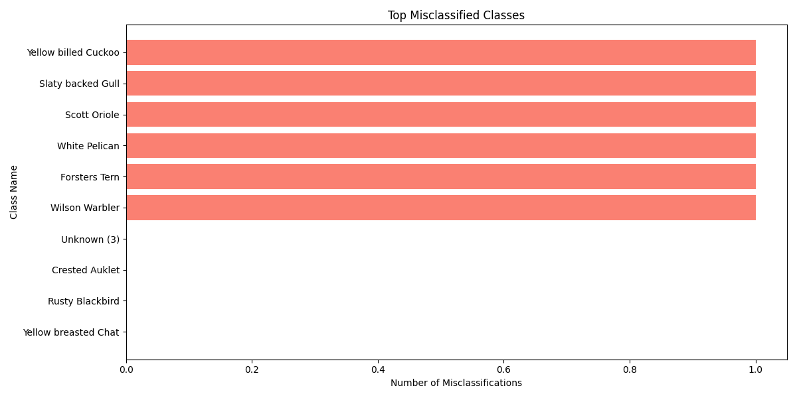

# Test Report

## Summary

- **Accuracy**: 0.82
- **Number of Images Tested**: 33
- **Unique Classes Tested**: 26

## Classification Report

| Class Name | Precision | Recall | F1-Score | Support |
|------------|-----------|--------|----------|---------|
| Unknown (3) | 0.00 | 0.00 | 0.00 | 0 |
| Crested Auklet | 1.00 | 1.00 | 1.00 | 1 |
| Rusty Blackbird | 1.00 | 1.00 | 1.00 | 1 |
| Yellow breasted Chat | 1.00 | 1.00 | 1.00 | 1 |
| Chuck will Widow | 1.00 | 1.00 | 1.00 | 3 |
| Red faced Cormorant | 1.00 | 1.00 | 1.00 | 2 |
| Yellow billed Cuckoo | 1.00 | 0.67 | 0.80 | 3 |
| Pine Grosbeak | 1.00 | 1.00 | 1.00 | 1 |
| Slaty backed Gull | 0.00 | 0.00 | 0.00 | 1 |
| Unknown (74) | 0.00 | 0.00 | 0.00 | 0 |
| Tropical Kingbird | 1.00 | 1.00 | 1.00 | 3 |
| Baltimore Oriole | 1.00 | 1.00 | 1.00 | 1 |
| Hooded Oriole | 1.00 | 1.00 | 1.00 | 3 |
| Unknown (97) | 0.00 | 0.00 | 0.00 | 0 |
| Scott Oriole | 1.00 | 0.67 | 0.80 | 3 |
| Unknown (100) | 0.00 | 0.00 | 0.00 | 0 |
| White Pelican | 0.00 | 0.00 | 0.00 | 1 |
| Field Sparrow | 1.00 | 1.00 | 1.00 | 1 |
| Song Sparrow | 1.00 | 1.00 | 1.00 | 1 |
| Unknown (141) | 0.00 | 0.00 | 0.00 | 0 |
| Forsters Tern | 0.00 | 0.00 | 0.00 | 1 |
| Unknown (161) | 0.00 | 0.00 | 0.00 | 0 |
| Magnolia Warbler | 1.00 | 1.00 | 1.00 | 1 |
| Wilson Warbler | 1.00 | 0.67 | 0.80 | 3 |
| Worm eating Warbler | 1.00 | 1.00 | 1.00 | 1 |
| Carolina Wren | 1.00 | 1.00 | 1.00 | 1 |

## Top Misclassified Classes

